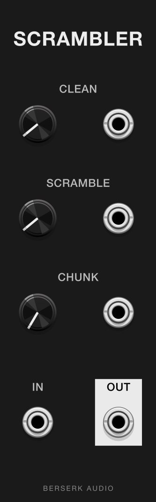
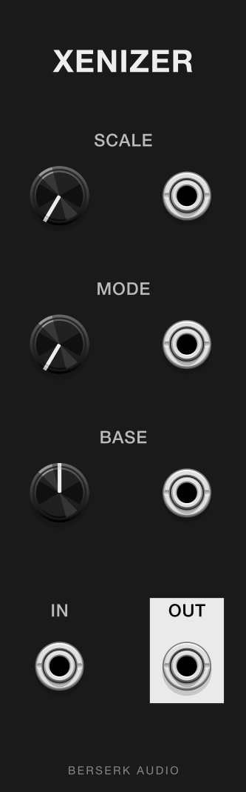
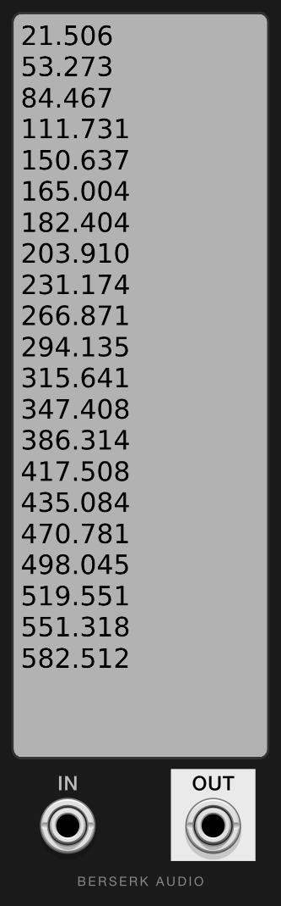

# Berserk Audio

A VCV Rack 2 plugin from Berserk Audio.

## Modules

- **Scrambler** — Alternates between clean passthrough and randomly reordered individual samples.
- **Xenizer** — Microtonal quantizer with preset scales.
- **XenScribe** *(not in MetaModule plugin)* — Microtonal quantizer that takes a custom scale typed in as cents.

  
